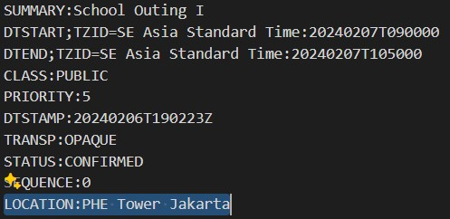
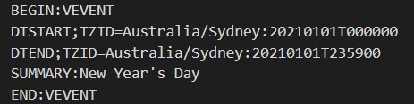

# cal-ics2md

**Markdown Calendar Generator**

> View your .ics calendars as monthly calendar in Markdown format!

#### Features

- Generate a monthly calendar in Markdown format from .ics files
- Supports general .ics files
- Events of the day in dropdown format
- Customizable event formatting and detail

#### Usage

###### Installation and Dependencies

This script requires Python and the following packages:
- <code>icalendar</code>
- <code>pyyaml</code>

Copy/download this repository. For git users:

```bash
git clone https://github.com/cc-christopher/cal-ics2md.git
```

Install the required packages:

```bash
pip install icalendar
pip install pyyaml
```

###### Configuration and Running

1. Navigate to the cal-ics2md directory and open the <code>config.yaml</code> file.
2. Paste the link to the .ics file after the <code>CALENDAR_URL</code> key.
3. Set your desired period between <code>START_MONTH</code> / <code>START_YEAR</code> and <code>END_MONTH</code> / <code>END_YEAR</code>.
4. Set your desired output file naming. Default is <code>calendar.md</code>.
5. On the same directory, run the script from the terminal:

    ```bash
    python cal-ics2md.py
    ``` 
6. Done! Have a cookie! 🍪

###### Customization

The current program is set for Bahasa Indonesia output. You can customize the <code>bulan</code> variable to change the month to your desired language. For days of the week, you can customize the <code>weekheader()</code> function.

To customize the event formatting, please modify to <code>generate_event()</code> function. Don't forget that the <code>df</code> variable needs to reflect additional columns you provided.

> :warning: **Warning**: Some .ics files may have different parameters which affects the <code>DataFrame</code> columns. Please check the .ics file and modify the <code>generate_event()</code> function and columns accordingly.
>
> For example, the first .ics file has a <code>LOCATION</code> parameter, while the second .ics file does not.
<figure>
    
    <figcaption>An .ics file with <code>LOCATION</code> parameter.</figcaption>
</figure>
<figure>
    
    <figcaption>An .ics file **without** <code>LOCATION</code> parameter.</figcaption>
</figure>


#### To-Do

- [ ] Add support for multiple .ics files
- [ ] Add multi-language support
- [ ] Reflect <code>DataFrame</code> column and <code>generate_event()</code> properties directly from parameters of the .ics file

###### Repository Information

Author: cc-christopher <https://github.com/cc-christopher>
GPL-3.0 License


